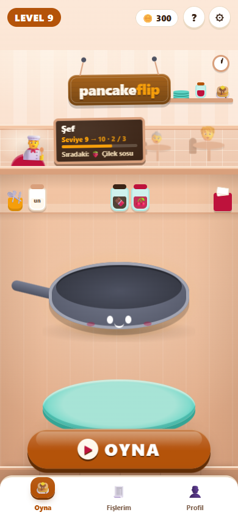
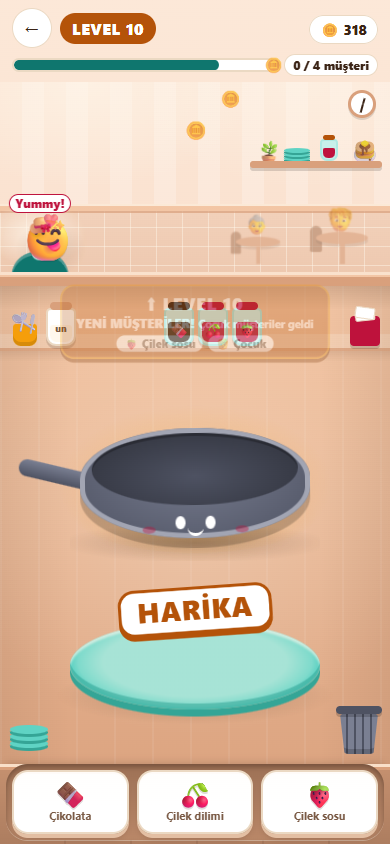

# 11 — Veri Sözleşmesi

Görev: [`tasks/week-4/11-veri-sozlesmesi.task.md`](../tasks/week-4/11-veri-sozlesmesi.task.md) · Dal: `feature/11-veri-sozlesmesi`

## Araç ve model

Claude Code (terminal ajanı), model Claude Opus 5.5.

## Şartname

- **Amaç:** Bütün veri tiplerini `src/lib/types/` altında tek yerde toplamak; tipli örnek veri, `bun run check` ve `docs/veri-modeli.md` ile veri sözleşmesini görünür kılmak.
- **Kapsam dışı:** Oyun kuralları ve sayıları (davranış değişmez), ekran görünümü, Rust.
- **Kabul ölçütleri:** en az 3 tip ayrı dosyalarda ve `index.ts`; her alanda açıklama; durum alanları sabit seçenek listesi; her ana tipten en az 6 örnek kayıt; dağınık tipler taşınmış, `any` yok; `bun run check` 0 hata; `docs/veri-modeli.md` ve AGENTS kuralı; `bun run build` 0 hata, `bun test` geçer.
- **Dokunulacak dosyalar:** `src/lib/types/*` (yeni), `src/types/oyun.ts` (silinir), tipleri içe aktaran dosyalar (yalnız `import` satırları), `src/lib/veri/ornek.ts` (yeni), `src/lib/oyun/ornek.test.ts` (yeni), `package.json`, `bun.lock`, `tsconfig.json`, `docs/veri-modeli.md` (yeni), `AGENTS.md`, mimari belgelerdeki yol atıfları.
- **Doğrulama adımları:** `bun run check`, `bun run build`, `bun test`, `cargo test`; oyunda bir sipariş teslim edip görünümün aynı kaldığını görmek; `any` araması.

## İstem

```text
Uygulamamın veri sözleşmesini tek yerde toplamak istiyorum. Uygulama: dikey ekranda krep pişirip müşterilerin siparişini birebir hazırladığımız, seviye atladıkça yeni malzemelerin açıldığı bir krep dükkânı oyunu.
Ana veri tiplerim: Malzeme, Sipariş, Müşteri, Fiş (adisyon). Eksik gördüğün tipi öner.
1. Mevcut kodu tara: bileşenlerde, store'larda ve veri dosyalarında tanımlı ya da ima edilen tipleri listele.
2. `src/lib/types/` altında her tip için ayrı dosya ve bir `index.ts` oluştur. Her alana tek satır açıklama yaz. Durum alanlarını sabit seçenek listesi yap.
3. Dağınık tip tanımlarını buraya taşı, içe aktarmaları güncelle. Hiçbir yerde `any` bırakma.
4. Örnek veriyi tek dosyada topla; her tipten en az 6 gerçekçi kayıt olsun.
5. `package.json`'a `check` betiği ekle (`astro check`) ve hataları sıfırla.
6. `docs/veri-modeli.md` yaz ve `AGENTS.md` indeksine ekle. Ayrıca `AGENTS.md`'ye şu kuralı ekle: yeni veri alanı önce `src/lib/types/` içinde tanımlanır.

Son olarak: `bun run build` 0 hata vermeli. Bitince hangi dosyaları neden değiştirdiğini madde madde özetle ve benim elle denemem gereken adımları yaz.
```

## Mevcut durum denetimi (değişiklikten önce)

| Madde | Durum | Kanıt |
|---|---|---|
| `src/lib/types/` en az 3 tip, `index.ts` | eksik | Tipler tek dosyada: `src/types/oyun.ts` |
| Alan açıklamaları, sabit seçenek listeleri | kısmen | Durum alanları zaten birleşim tipi (`Sonuc`, `Kalinlik`, `PismeBolgesi`…); açıklamaların çoğu yok |
| Her tipten en az 6 örnek kayıt, tek dosyada | kısmen | `malzemeler.json` 8, `musteriler.json` 4; sipariş, müşteri ve fiş örneği yok |
| Dağınık tipler taşınmış; `any` yok | kısmen | `any` yok; `Restoran.svelte` (`Ayrilan` + 5 isimsiz durum tipi), `Tava.svelte` (`Fx`), `tema.svelte.ts` (`Tema`), `seviye.ts` (`Acilis`), `ilerlemeKaydi.ts` (`IlerlemeVerisi`) |
| `bun run check` 0 hata | eksik | Betik yok |
| `docs/veri-modeli.md` ve AGENTS kuralı | eksik | — |

## Plan (değişiklikten önce sunuldu)

1. Geliştirme bağımlılıkları: `@astrojs/check` (`astro check` için) ve `@types/bun` (testlerdeki `bun:test` ve `node:url` tip bildirimleri). Bağımlılık kırmızı çizgi olduğu için kullanıcıya soruldu, onay alındı.
2. `src/lib/types/`: `malzeme.ts`, `siparis.ts`, `musteri.ts`, `tabak.ts`, `fis.ts`, `seviye.ts`, `ayarlar.ts`, `arayuz.ts`, `index.ts`. Her alan tek satır açıklamalı.
3. `src/types/oyun.ts` silinir; 18 dosyanın yalnız `import` satırı değişir. `Acilis`, `IlerlemeVerisi`, `Tema` ve bileşen içi tipler taşınır; eski yerlerinden tip olarak yeniden dışa aktarılır (davranış değişmez).
4. `src/lib/veri/ornek.ts`: 6 sipariş, 6 müşteri, 6 fiş; uygunluğunu denetleyen `ornek.test.ts`.
5. `docs/veri-modeli.md`, `AGENTS.md` kuralı ve indeks satırı; eski yolu anan belgeler güncellenir.

## Düzeltmeler

- `@types/bun` eklendikten sonra `astro check` hâlâ `bun:test` bulamadı. `tsconfig.json`'a `"types": ["bun"]` eklendi.
- Bun tipleri yüklenince iki gerçek tip hatası ortaya çıktı: `ilerlemeKaydi.test.ts` içindeki test nesnelerinde `surum: 1` alanı `number` olarak genişliyordu (kayıt tipi `1` bekliyor). Test nesnelerine `as const` eklendi; test davranışı değişmedi.
- İlk taşımada `Restoran.svelte` içindeki 5 isimsiz `$state<{…}>` durum tipi gözden kaçmıştı; ikinci aramada bulundu ve `arayuz.ts`'e isimli tip olarak taşındı.
- `docs/klasor-mimarisi.md`, `docs/oyun-mimarisi.md`, `docs/ortak-gelistirme.md` eski `src/types/oyun.ts` yolunu anıyordu; yeni yola çevrildi (geçmiş görev planı `gelistirme-plani.md` olduğu gibi bırakıldı).

## Doğrulama

```text
$ bun run check
Result (49 files):
- 0 errors
- 0 warnings
- 1 hint

$ bunx svelte-check
COMPLETED 809 FILES 0 ERRORS 3 WARNINGS        (görev öncesi: 7 hata; hepsi tip bildirimi eksikliğiydi)

$ bun test
 95 pass
 0 fail                                         (91 eski + 4 yeni örnek veri testi)

$ bun run build
19 page(s) built … Complete!

$ cargo test
test result: ok. 2 passed; 0 failed
```

- `any` araması (`: any`, `<any>`, `as any`): 0 sonuç.
- Oyunda gerçek dokunuşlarla bir sipariş teslim edildi (krep → 🍫 → krep): HARİKA, +18 coin, seviye 9 → 10; görünüm görev öncesiyle aynı.

 
