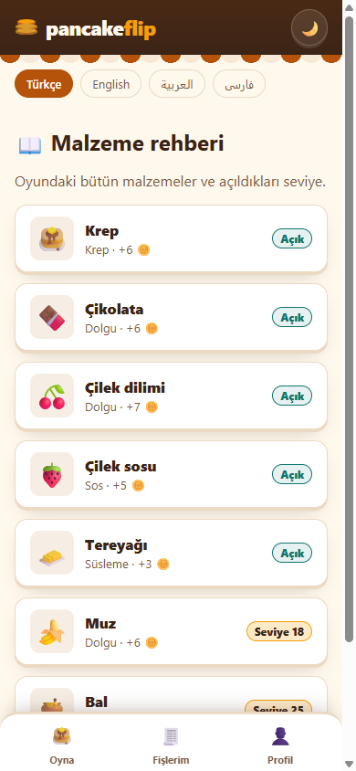
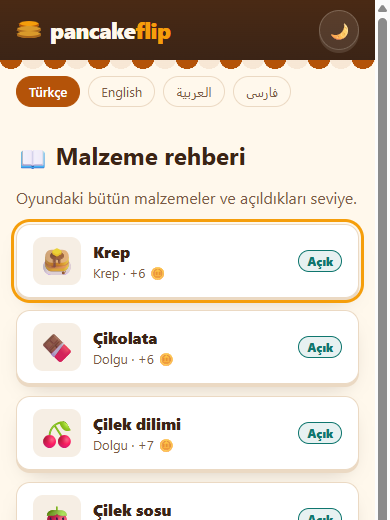
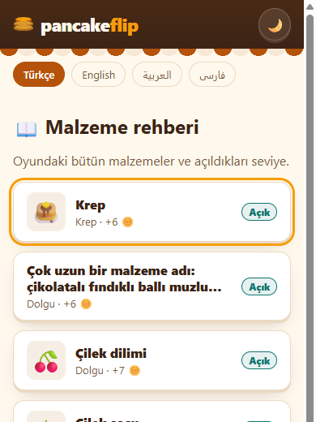
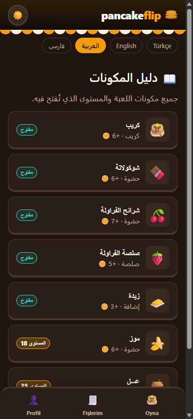

# 12 — Kart Bileşeni

Görev: [`tasks/week-4/12-kart-bileseni.task.md`](../tasks/week-4/12-kart-bileseni.task.md) · Dal: `feature/12-kart-bileseni`

## Araç ve model

Claude Code (terminal ajanı), model Claude Opus 5.5.

## Şartname

- **Amaç:** Listelerde kullanılacak, veri tipini tanımayan tek bir kart bileşeni; kartlarla kurulan ilk liste ekranı.
- **Kapsam dışı:** Oyun ekranı (`/`), oyun kuralları, Fişlerim'in fiş tasarımı.
- **Kabul ölçütleri:** `src/lib/components/ui/Kart.svelte` genel girdilerle, girdi tipi `src/lib/types/ui.ts`'de; bileşende sabit renk/boşluk yok; görselsiz, uzun başlıklı ve RTL'de bozulmuyor; Tab ile odaklanıp Enter ile açılıyor; görselin alternatif metni var; liste ekranında en az 6 kart.
- **Dokunulacak dosyalar:** `src/lib/components/ui/Kart.svelte`, `src/lib/types/ui.ts`, `src/lib/types/index.ts`, `src/styles/app.css` (boşluk değişkenleri), `docs/branding.md`, `src/components/rehber/*`, `src/pages/{,en/,ar/,fa/}rehber/index.astro`, `src/lib/i18n.ts`, `src/components/Profil.svelte` (bağlantı), `docs/mimari-agac.md`.
- **Doğrulama adımları:** `bun run check`, `bun run build`, `bun test`; 390×844'te TR gündüz ve AR gece; Tab/Enter; görselsiz ve uzun başlık denemesi.

## Ana ekran kararı

Ana ekranımız (`/`) bir oyun sahnesidir, kart listesi yoktur. Kullanıcıyla birlikte kararlaştırıldı: kartlar yeni **Malzeme rehberi** (`/rehber`, dört dilde) listesinde kullanılır. Rehber oyunun 8 malzemesini gösterdiği için oyuncunun kaydı boş olsa da en az 6 kart görünür. Rehber Profil → Bilgi'den açılır. Eski, ekrana özel bir kart kodu olmadığı için silinecek kod yoktur.

## İstem

```text
Uygulamamda listelerde kullanacağım tek bir kart bileşeni istiyorum.
1. `src/lib/components/ui/Kart.svelte` oluştur. Girdiler: baslik, altMetin?, gorsel?, etiket?, etiketTuru? ('bilgi' | 'basari' | 'uyari' | 'hata'), href? ya da tıklama olayı. Girdi tipini `src/lib/types/ui.ts` içinde tanımla.
2. Bileşen benim veri tiplerimi içe aktarmasın; dönüşümü kartı kullanan ekran yapsın.
3. Bütün renk, boşluk ve köşe değerleri `src/styles/app.css` değişkenlerinden gelsin. Eksik değişken varsa önce oraya ekle.
4. Görselsiz, çok uzun başlıklı ve sağdan sola düzende düzgün görünsün. Klavyeyle odaklanıp Enter ile açılabilsin.
5. Malzeme rehberi ekranındaki listeyi bu kartla kur (yeni ekran: /rehber, dört dilde); ekrana özel eski kart kodu yok.

Son olarak: `bun run build` 0 hata vermeli. Bitince hangi dosyaları neden değiştirdiğini madde madde özetle ve benim elle denemem gereken adımları yaz.
```

## Plan (değişiklikten önce sunuldu)

1. `app.css`'e boşluk ölçeği (`--bosluk-1` … `--bosluk-4`); tek kaynak kuralı gereği `branding.md` tablosuna da eklenir. Renk eklenmez.
2. `types/ui.ts`: `EtiketTuru`, `KartGirdileri` (görsel yerine emoji için `ikon`, alternatif metin için `gorselAlt` ek girdileri).
3. `Kart.svelte`: `href` → `<a>`, `onclick` → `<button>`, ikisi yoksa `<div>`; odak çerçevesi `--renk-logo`; başlık iki satırda kesilir; mantıksal hizalama (`text-align: start`) ile RTL kendiliğinden döner.
4. `RehberListe.svelte`: `MALZEMELER` → `KartGirdileri` dönüşümü; açık/kilitli etiketi cihazdaki seviyeden; kart, malzemenin kendi adresine (`/rehber/<id>`) gider (detay ekranı Görev 14).
5. Dört dilde `rehber` sayfası, `i18n.ts` metinleri, Profil'den bağlantı, mimari ağaç.

## Düzeltmeler

- Kart sınıfı ilk planda `kart` adıyla düşünülmüştü; `app.css`'te aynı adla genel bir `.kart` sınıfı olduğu için çakışmasın diye `ui-kart` yapıldı.
- `uyari` etiketinde `--renk-logo` rengindeki yazı açık zeminde okunaksız kalıyordu; yazı `--yazi`, kenar `--renk-logo` yapıldı.
- Kartlar `/rehber/<id>` adresine gider; o sayfa Görev 14'te eklenir (bu PR ile Görev 14 arasında bağlantı boş sayfaya çıkar).

## Doğrulama

```text
$ bun run check        → 0 errors, 0 warnings
$ bun run build        → 23 page(s) built (+ /rehber, /en/rehber, /ar/rehber, /fa/rehber), 0 hata
$ bun test             → 95 pass, 0 fail
$ grep -E "#[0-9a-fA-F]{3,8}" Kart.svelte → 0 sonuç (sabit renk yok)
```

390×844, gerçek tarayıcı (Playwright):

| Deneme | Sonuç |
|---|---|
| `/rehber` kart sayısı | 8 (seviye 12'de 5 "Açık" başarı, 3 "Seviye N" uyarı etiketi) |
| Görsel alternatif metni | Her kartın ikonu `role="img"` + `aria-label` |
| Tab ile gezinme | Odak karta geliyor, 3 px `--renk-logo` çerçeve; Enter `/rehber/krep` adresini açıyor |
| Görselsiz + çok uzun başlık | Kart genişliği 343 px'te kaldı, başlık 2 satırda kesildi, etiket kartın içinde |
| `/ar/rehber` gece | `dir="rtl"`, ikon sağda, etiket solda, Arapça metinler |
| `/fa/rehber`, `/en/rehber` | 8 kart; FA `rtl` |
| Yatay taşma | Yok |

   
