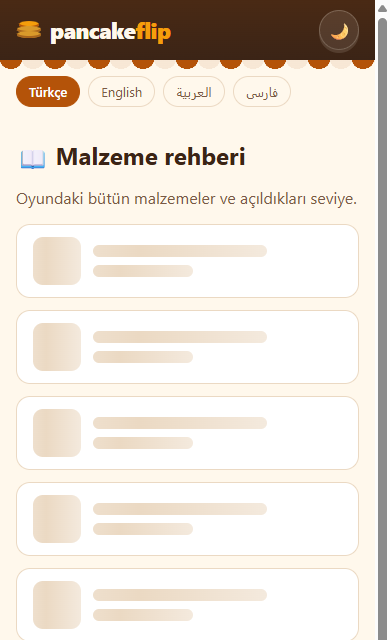
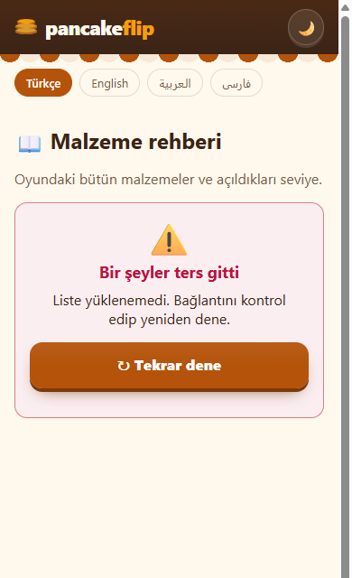
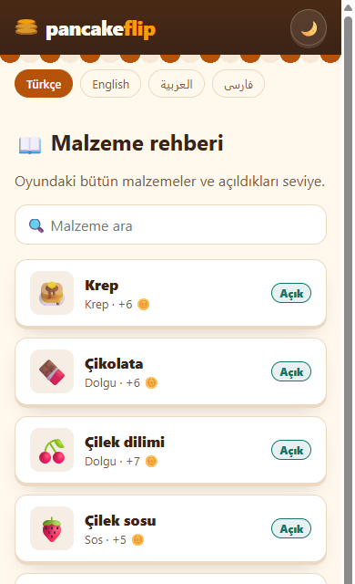
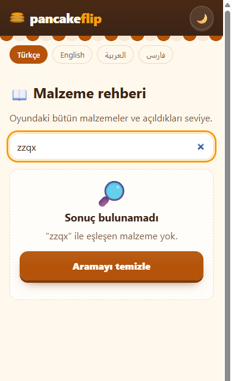
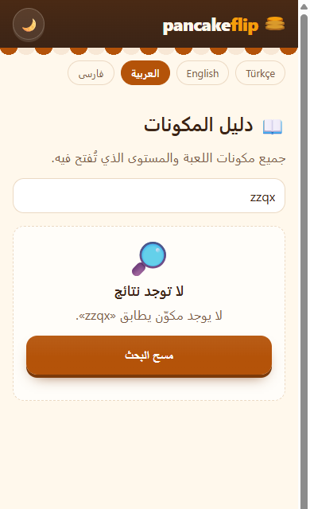
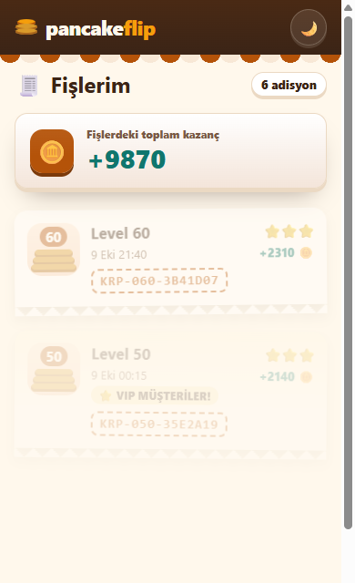

# 13 — Liste Ekranı ve Üç Durum

Görev: [`tasks/week-4/13-liste-ve-uc-durum.task.md`](../tasks/week-4/13-liste-ve-uc-durum.task.md) · Dal: `feature/13-liste-ve-uc-durum`

## Araç ve model

Claude Code (terminal ajanı), model Claude Opus 5.5.

## Şartname

- **Amaç:** Liste ekranları veri hazır değilken de ne olduğunu söylesin: yükleniyor, hata, boş, dolu.
- **Kapsam dışı:** Oyun ekranı ve kuralları; Fişlerim'in fiş tasarımı (yalnız durumları değişir).
- **Kabul ölçütleri:** `ui/` altında `Yukleniyor`, `BosDurum`, `HataDurumu` (genel girdiler, sabit renk yok); ana liste tek yükleme işlevinden veri alır ve dört hâlden yalnız birini gösterir; arama boşsa boş hâl + temizleme düğmesi; metinler TR/EN/AR/FA; aynı bileşenler ikinci listede; dört hâlin ekran görüntüsü günlükte.
- **Dokunulacak dosyalar:** `src/lib/components/ui/{Yukleniyor,BosDurum,HataDurumu}.svelte`, `src/lib/types/ui.ts`, `src/lib/yukleyici.ts` (yeni), `src/lib/i18n.ts`, `src/components/rehber/RehberListe.svelte`, `src/components/Fislerim.svelte`, `docs/gelistirme-notlari.md` (yeni), `AGENTS.md`.
- **Doğrulama adımları:** `bun run check`, `bun run build`, `bun test`; `?durum=` ile dört hâl, Tekrar dene, saçma arama, dil değiştirme.

## İstem

```text
Ana liste ekranımda (Malzeme rehberi, /rehber) veri hazır değilken de düzgün bir şey göstermek istiyorum.
1. `src/lib/components/ui/` altında üç genel bileşen oluştur: Yukleniyor (iskelet), BosDurum (baslik, aciklama, dugmeMetni?, tıklama olayı), HataDurumu (mesaj, tekrar dene olayı). Renkler `app.css` değişkenlerinden.
2. Liste verisini tek bir yükleme işlevinden al. Ekran dört halden yalnız birini göstersin: yükleniyor, hata, boş, dolu.
3. Arama ya da süzgeç sonucu boşsa BosDurum göster ve süzgeci temizleme düğmesi ekle.
4. Metinleri dört dile ekle (TR, EN, AR, FA).
5. Aynı bileşenleri Fişlerim ekranına da bağla.
6. Dört hali elle deneyebilmem için geliştirme sırasında kullanacağım basit bir yol öner (örn. adres çubuğuna `?durum=hata` yazmak) ve bunu `docs/gelistirme-notlari.md` içine yaz.

Son olarak: `bun run build` 0 hata vermeli. Bitince hangi dosyaları neden değiştirdiğini madde madde özetle ve benim elle denemem gereken adımları yaz.
```

## Plan (değişiklikten önce sunuldu)

1. Girdi tipleri `types/ui.ts`'e: `ListeDurumu`, `YukleniyorGirdileri`, `BosDurumGirdileri`, `HataDurumuGirdileri`, `ZorlananDurum`.
2. Üç bileşen: iskelet kartlar (`aria-busy`, ekran okuyucuya yalnız metin; hareket azaltmada parıltı yok), boş hâl (bağlantı ya da eylem düğmesi), hata hâli (`role="alert"`, Tekrar dene).
3. `src/lib/yukleyici.ts`: `malzemeleriYukle()` ve `fisleriYukle()`; geliştirme için `?durum=yukleniyor|hata|bos|ornek`. `?durum=hata` yalnız ilk denemede hata verir; böylece Tekrar dene gerçekten listeyi getirir.
4. `RehberListe`: dört hâl + arama kutusu; arama adreste `?q=` (Görev 14'te geri dönüşte korunsun diye).
5. Fişlerim: aynı yükleyici ve üç bileşen; eski ekrana özel boş hâl kodu ve CSS'i silinir.
6. Metinler `i18n.ts`'te dört dilde; `docs/gelistirme-notlari.md` ve AGENTS indeksi.

## Düzeltmeler

- İlk taslakta Rehber'in boş hâl düğmesi yer tutucu bir emoji ve gereksiz bir koşulla yazılmıştı; dört dilde "Oyna" metni (`durumMetni.oyna`) ve düz `href="/"` yapıldı.
- svelte-check, Görev 12'deki `Kart.svelte` için yeni bir uyarı verdi ("standart `line-clamp` özelliğini de tanımla"). `line-clamp: 2` eklendi; uyarı sayısı yine eski 3'e indi.
- Fişlerim'de hata → Tekrar dene sonrası "boş" hâl görünüyor: bu tarayıcıda gerçekten fiş yok; doğru davranış. Dolu hâli görmek için `?durum=ornek` eklendi (örnek veri: Görev 11).

## Doğrulama

```text
$ bun run check   → 0 errors, 0 warnings
$ bunx svelte-check → 0 ERRORS, 3 WARNINGS (eski üç uyarı)
$ bun test        → 95 pass, 0 fail
$ bun run build   → 23 page(s) built, 0 hata
```

390×844, gerçek tarayıcı:

| Deneme | Sonuç |
|---|---|
| `/rehber?durum=yukleniyor` | İskelet; ekran okuyucu metni "Yükleniyor…" |
| `/rehber?durum=hata` | "Bir şeyler ters gitti"; **Tekrar dene** → 8 kart |
| `/rehber?durum=bos` | "Burada henüz bir şey yok" + "🥞 Oyna" |
| `/rehber` | 8 kart (dolu) |
| Arama `zzqx` | "Sonuç bulunamadı" + **Aramayı temizle**; adres `?q=zzqx`; temizleyince 8 kart ve adres temiz |
| Arama `çilek` | 2 kart; adres `?q=çilek` |
| EN / AR / FA `?durum=hata`, `?durum=bos` | Metinler çevrildi; AR ve FA `rtl` |
| `/ar/rehber?q=zzqx` | "لا توجد نتائج" + "مسح البحث" |
| Fişlerim (ikinci liste) | Boş, hata → Tekrar dene, yükleniyor ve `?durum=ornek` ile 6 fiş |
| Yatay taşma, sayfa hatası | Yok |

   

  
