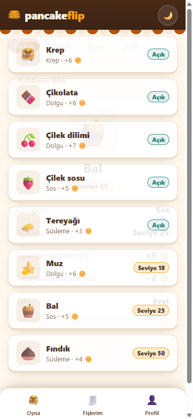
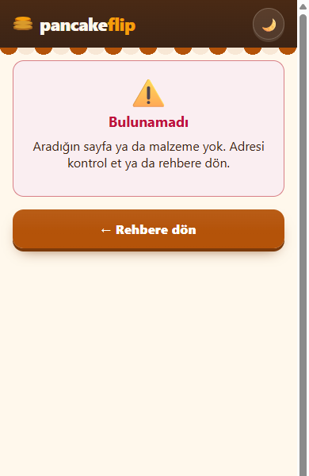
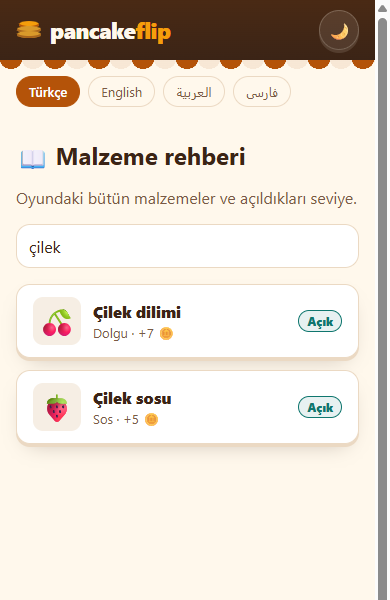
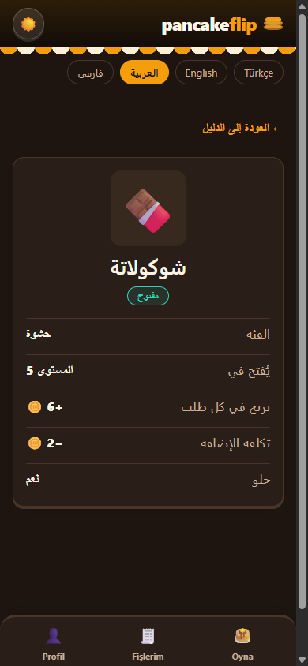

# 14 — Detay Ekranı ve Gezinme

Görev: [`tasks/week-4/14-detay-ekrani.task.md`](../tasks/week-4/14-detay-ekrani.task.md) · Dal: `feature/14-detay-ekrani`

## Araç ve model

Claude Code (terminal ajanı), model Claude Opus 5.5.

## Şartname

- **Amaç:** Rehberdeki karta dokununca malzemenin kendi adresi olan bir detay ekranı açılsın; geri dönüş ve doğrudan açılış çalışsın.
- **Kapsam dışı:** Oyun ekranı ve kuralları; Fişlerim.
- **Kabul ölçütleri:** Adres kimliği içerir (`/rehber/cikolata`); geri dönünce liste araması korunur; olmayan kimlikte `HataDurumu` ile "bulunamadı"; detay dört dilde derlenir, AR/FA sağdan sola; `docs/mimari-agac.md` güncel.
- **Dokunulacak dosyalar:** `src/pages/{,en/,ar/,fa/}rehber/[id].astro`, `src/pages/404.astro`, `src/components/rehber/{RehberDetay,RehberDetaySayfa,Bulunamadi}.*`, `src/components/rehber/rehber.ts`, `src/components/rehber/RehberListe.svelte`, `src/components/bilgi/DilSecici.astro`, `src/lib/i18n.ts`, `docs/mimari-agac.md`.
- **Doğrulama adımları:** üç karta tıkla; olmayan kimlik; arama → detay → geri; adresi yeni pencerede aç; dört dil.

## İstem

```text
Malzeme için detay ekranı istiyorum.
1. Karta tıklayınca `/rehber/[id]` adresinde detay ekranı açılsın. Mevcut dil rotası düzenine uy (/en/rehber/[id], /ar/…, /fa/…).
2. Detayda şunlar görünsün: büyük ikon, ad, açık / kilitli durumu, kategori, açıldığı seviye, siparişte kazandırdığı coin, tabağa koyma maliyeti, tatlı mı.
3. Geri düğmesi listeye dönsün; listedeki arama ve süzgeç seçimi kaybolmasın.
4. Olmayan bir kimlikle açılırsa Görev 13'teki HataDurumu bileşeniyle "bulunamadı" göster.
5. `docs/mimari-agac.md` içindeki sayfa ağacını güncelle.

Son olarak: `bun run build` 0 hata vermeli. Bitince hangi dosyaları neden değiştirdiğini madde madde özetle ve benim elle denemem gereken adımları yaz.
```

## Mevcut durum denetimi (değişiklikten önce)

| Madde | Durum | Kanıt |
|---|---|---|
| Karta tıklayınca detay, adres kimlikli | kısmen | Kartlar Görev 12'den beri `/rehber/<id>` adresine gidiyor; sayfa yok |
| Geri dönüş, arama korunur | kısmen | Arama Görev 13'ten beri adreste (`?q=`) |
| Olmayan kimlikte anlamlı ekran | eksik | Proje 404 sayfası yok |
| Dört dilde, RTL | eksik | — |
| Mimari ağaç | eksik | `/rehber/[id]` yok |

## Plan (değişiklikten önce sunuldu)

1. Statik derleme: her malzeme için `getStaticPaths` ile sayfa; dört dil için aynı sayfa dosyası (`RehberDetaySayfa.astro` ortak iskelet).
2. `RehberDetay.svelte`: kimlikle malzemeyi bulur; bulamazsa `HataDurumu`.
3. Olmayan kimlik derlemede sayfa üretmez; `src/pages/404.astro` + `Bulunamadi.svelte` dili adresten bulup `HataDurumu` ve rehbere dönüş bağlantısı gösterir.
4. Geri: tarayıcı geçmişi yerine listenin son adresi (arama dahil) oturum deposunda tutulur; detaydaki geri bağlantısı oraya gider.
5. Dil seçici yolun tamamını korusun (`/en/rehber/cikolata` → `/ar/rehber/cikolata`).
6. Metinler `i18n.ts`'te; mimari ağaç.

## Düzeltmeler

- İlk yazımda geri bağlantısı `document.referrer` ile rehberden gelinip gelinmediğine bakıp `history.back()` yapıyordu. Astro'nun istemci yönlendiricisinde (ClientRouter) sayfa geçişleri `referrer`'ı güncellemediği için bu güvenilir değildi; liste kendi son adresini (`?q=` dahil) `sessionStorage`'a yazacak, detay oraya dönecek şekilde değiştirildi.
- Dil seçici yalnız yolun ilk parçasını kullanıyordu; detayda dil değiştirince listeye düşüyordu. `dilsizYol()` eklendi; bilgi sayfalarında sonuç aynı.

## Doğrulama

```text
$ bun run check   → 0 errors, 0 warnings
$ bun run build   → 56 page(s) built (32 detay + 404), 0 hata
$ bun test        → 95 pass, 0 fail
```

390×844, gerçek tarayıcı:

| Deneme | Sonuç |
|---|---|
| Üç karta tıklama (Çikolata, Tereyağı, Bal) | Her biri kendi adresinde doğru öğe: `/rehber/cikolata` (Dolgu, Seviye 5, +6, −2, tatlı), `/rehber/tereyagi` (Süsleme, Seviye 12, +3, −1), `/rehber/bal` (Sos, Seviye 25) |
| `/rehber/olmayan-malzeme` | HTTP 404, `HataDurumu` "Bulunamadı" + "← Rehbere dön" (`/rehber`) |
| `/ar/rehber/yok` | 404, Arapça metin, `rtl` |
| Arama "çilek" → detay → geri | Adres `/rehber?q=çilek`, arama kutusu dolu, 2 kart |
| Detay adresini yeni pencerede açma | Aynı ekran (Muz); geri bağlantısı düz listeye |
| `/en`, `/ar`, `/fa` + `/rehber/cikolata` | Çevrilmiş alanlar; AR ve FA `rtl` |
| Dil seçici (detayda) | `/rehber/cikolata`, `/en/…`, `/ar/…`, `/fa/…` (aynı malzeme) |
| Yatay taşma, sayfa hatası | Yok |

   
