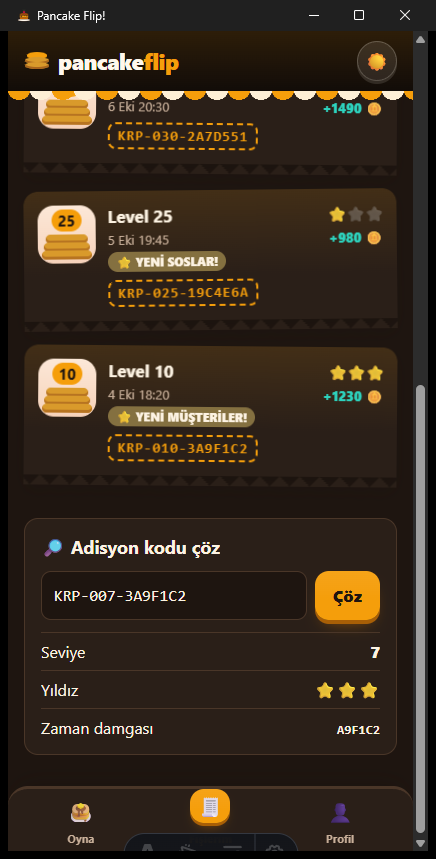
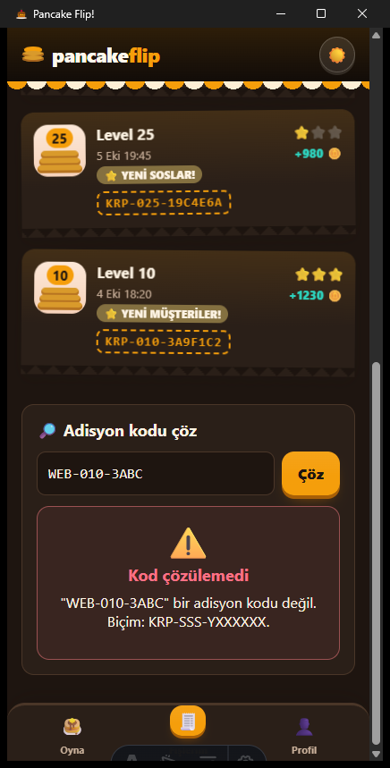
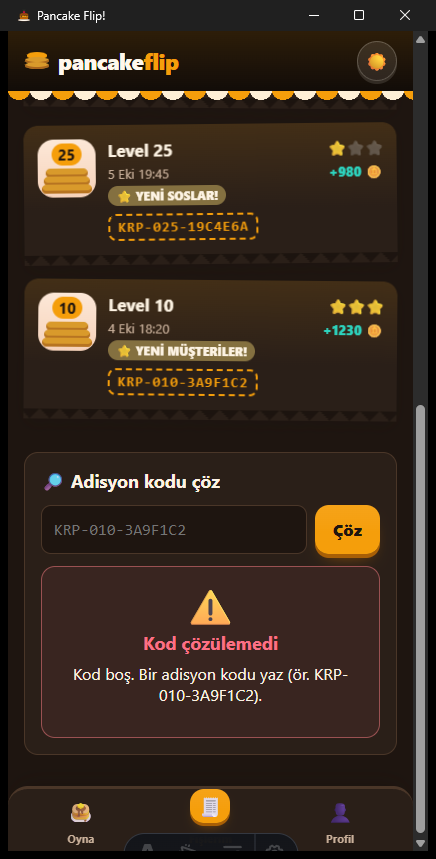
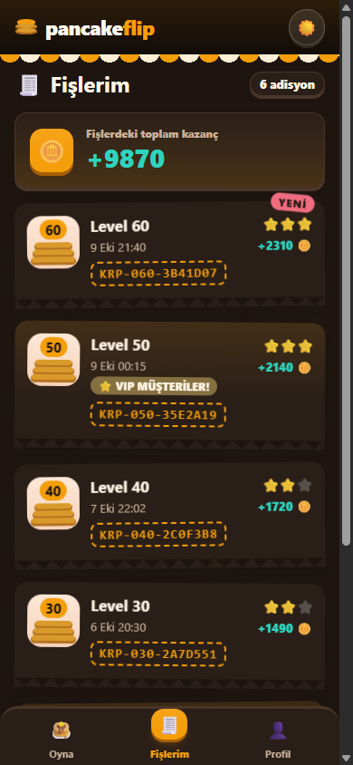

# 15 — Rust Komutu: Tipli Sonuç ve Hata

Görev: [`tasks/week-4/15-rust-komutu.task.md`](../tasks/week-4/15-rust-komutu.task.md) · Dal: `feature/15-rust-komutu`

## Araç ve model

Claude Code (terminal ajanı), model Claude Opus 5.5.

## Şartname

- **Amaç:** Rust komutları tipli sonuç ve tipli hata dönsün; ön yüz Rust'ı tek dosyadan çağırsın; tarayıcıda çökmesin; platform kuralı uygulansın.
- **Kapsam dışı:** Oyun kuralları, ödül ve fiş kesme zamanlaması (yalnız kodun nereden geldiği değişir); yeni bağımlılık (Tauri işletim sistemi eklentisi eklenmedi).
- **Kabul ölçütleri:** projeye özgü komut, `struct` sonuç ve `enum` hata, panik yok; bütün çağrılar `src/lib/native.ts`'ten; tarayıcı yedeği; tipler `src/lib/types/` içinde Rust ile aynı alanlarla; hata `HataDurumu` ile görünür; en az 2 Rust testi; `docs/komutlar.md`; `docs/platform-destegi.md`, `platform()`, `destekleniyorMu()`, AGENTS kuralı.
- **Dokunulacak dosyalar:** `src-tauri/src/lib.rs`, `src/lib/native.ts` (yeni), `src/lib/native.test.ts` (yeni), `src/lib/types/native.ts` (yeni), `src/lib/types/index.ts`, `src/lib/fisler.svelte.ts`, `src/components/Fislerim.svelte`, `docs/komutlar.md` (yeni), `docs/platform-destegi.md` (yeni), `docs/oyun-mimarisi.md`, `AGENTS.md`.
- **Doğrulama adımları:** `cargo test`, `bun test`, `bun run check`, `bun run build`; gerçek Tauri uygulamasında doğru ve hatalı kod; tarayıcıda aynı ekran; `native.ts` dışında Tauri çağrısı araması.

## Mevcut durum denetimi (değişiklikten önce)

| Madde | Durum | Kanıt |
|---|---|---|
| Projeye özgü komut | kısmen | `fis_olustur(bolum_id, yildiz) -> String`: düz metin döner, yıldızı sessizce 3'e kırpar, saat hatasında `unwrap` |
| Tek giriş noktası `native.ts` | eksik | `invoke` ve `isTauri` `src/lib/fisler.svelte.ts` içinde |
| Tarayıcı yedeği | kısmen | `fisler.svelte.ts` tarayıcıda `WEB-` kodu üretiyor |
| Tipler `types/` içinde, hata arayüzde | eksik | Sonuç düz `string`; hata gösterimi yok |
| En az 2 Rust testi | karşılanıyor | `ornek_bicim`, `yildiz_en_fazla_3_ve_hex_6_hane` |
| `docs/komutlar.md`, platform tablosu | eksik | — |

## İstem

```text
Uygulamamın Rust tarafında şu işi yapan bir komut istiyorum: seviye adisyonu kodu üretmek (KRP-SSS-YXXXXXX) ve verilen bir adisyon kodunu çözüp içindeki seviye, yıldız ve zaman damgasını okumak.
1. Komut başarıda alanları belli bir yapı (struct), başarısızlıkta türleri belli bir hata (enum) döndürsün. Düz String döndürme. Geçersiz girdide panik yapma, hata döndür.
2. Şablondan kalan örnek komutu kaldır ya da bu komuta dönüştür.
3. Arayüz tarafında `src/lib/native.ts` oluştur (varsa genişlet): Rust çağrılarının hepsi yalnız bu dosyadan geçsin. Bileşenlerdeki doğrudan çağrıları buraya taşı.
4. Uygulama tarayıcıda çalışıyorsa `native.ts` çökmesin: makul bir yedek sonuç ya da "yalnız uygulamada" hatası dönsün.
5. Sonuç ve hata tiplerini `src/lib/types/` altına, Rust yapısıyla aynı alanlarla yaz.
6. Hatayı arayüzde HataDurumu bileşeniyle göster.
7. Rust tarafına en az 2 test yaz (bir başarılı, bir hatalı girdi) ve `cargo test` çalıştır.
8. Komutu, girdilerini, çıktısını ve hata türlerini `docs/komutlar.md` içine yaz; `AGENTS.md` indeksine ekle.
9. Platform kuralı: uygulamam Android, iOS, macOS, Windows ve Linux'ta çalışmalı. Uygulamadaki her özelliği (bu komut dahil) beş platform için değerlendir: destekleniyor / farklı yolla destekleniyor / desteklenmiyor. Farklı yolla desteklenenleri o platformun yoluyla yap. Hiç desteklenmeyenleri o platformda arayüzden tamamen kaldır; devre dışı düğme ya da hata mesajı bırakma.
10. `native.ts` içine `platform()` ve `destekleniyorMu(ozellik)` ekle; bileşenler platform adını kendileri sorgulamasın. Sonucu `docs/platform-destegi.md` içine özellik × platform tablosu olarak yaz ve `AGENTS.md`'ye şu kuralı ekle: yeni özellik eklenirken bu tablo güncellenir.

Son olarak: `bun run build` 0 hata vermeli. Bitince hangi dosyaları neden değiştirdiğini madde madde özetle ve benim elle denemem gereken adımları yaz.
```

## Plan (değişiklikten önce sunuldu)

1. Rust: `fis_olustur(seviye, yildiz) -> Result<Adisyon, FisHatasi>` (seviye 1–1.000.000.000, yıldız 0–3; yıldız artık kırpılmaz, hata döner; saat hatasında panik yok). Yeni `fis_coz(kod) -> Result<FisBilgisi, FisHatasi>`. Hata `#[serde(tag = "tur")]` ile `{ tur, … }` JSON'u.
2. Rust testleri: geçerli girdi, geçersiz girdi, kod çözme, bozuk kodlar, hata JSON biçimi (eski 2 test kalır).
3. `types/native.ts`: `Adisyon`, `FisBilgisi`, `FisHatasi`, `NativeHata`, `NativeSonuc<T>`, `Platform`, `Ozellik`.
4. `native.ts`: `uygulamadaMi()`, `platform()` (işletim sistemi tarayıcı motorunun kimliğinden; Tauri işletim sistemi eklentisi yeni bağımlılık olacağı için eklenmedi), `destekleniyorMu()`, `fisOlustur()` (tarayıcıda `WEB-` yedeği, aynı girdi denetimi), `fisCoz()` (tarayıcıda `YalnizUygulamada`). İstisna fırlatmaz.
5. `fisler.svelte.ts` `native.ts` üzerinden; Tauri içe aktarımı kalmaz.
6. Fişlerim'e **Adisyon kodu çöz** bölümü: yalnız `destekleniyorMu("fisCoz")` ise görünür; hata `HataDurumu` ile; `/fislerim?kod=…` bağlantısı kodu doldurup çözer.
7. `native.test.ts`, `docs/komutlar.md`, `docs/platform-destegi.md`, AGENTS kuralları ve indeks; `oyun-mimarisi.md` Rust bölümü.

## Düzeltmeler

- Özellik listesine ilk taslakta "harici bağlantı" (opener eklentisi) konmuştu; ön yüzde bu eklentiyi kullanan kod olmadığı için gerçek olmayan bir özellik olacaktı, çıkarıldı.
- Platform tablosundaki ses satırı "ilk dokunuşta başlatılır" diye yazılmıştı; `ses.ts` okununca ses motorunun ilk ses istendiğinde kurulup askıdaysa `resume` edildiği görüldü ve metin buna göre düzeltildi.
- Gerçek uygulamada `?kod=` ile açılınca çözüm sonucu listenin altında, görünmeyen yerde kalıyordu; bağlantıyla açılınca bölüme kaydırma eklendi.
- `docs/oyun-mimarisi.md` eski `fis_olustur(bolum_id, …) -> String` imzasını anlatıyordu; `komutlar.md`'ye yönlendiren güncel özetle değiştirildi.

## Doğrulama

```text
$ cd src-tauri && cargo test
test testler::ornek_bicim ... ok
test testler::yildiz_en_fazla_3_ve_hex_6_hane ... ok
test testler::gecerli_girdi_adisyon_doner ... ok
test testler::gecersiz_girdi_hata_doner_panik_yok ... ok
test testler::kod_cozulur_ve_uretilenle_ayni ... ok
test testler::bos_ve_bozuk_kod_hata_doner ... ok
test testler::hata_json_bicimi_on_yuzle_ayni ... ok
test result: ok. 7 passed; 0 failed

$ bun test          → 99 pass, 0 fail   (+4: native.ts tarayıcı yedeği)
$ bun run check     → 0 errors, 0 warnings
$ bunx svelte-check → 0 ERRORS
$ bun run build     → 56 page(s) built, 0 hata
```

- `native.ts` dışında Tauri çağrısı yapan dosya: `grep -rln "@tauri-apps" src` → yalnız `src/lib/native.ts`.
- **Gerçek uygulama** (`bun run tauri dev`, pencere doğrudan `/fislerim?durum=ornek&kod=…` adresiyle açıldı; kaynak kod değiştirilmeden `--config` ile):
  - `KRP-007-3A9F1C2` → Rust çözdü: Seviye 7, ⭐⭐⭐, damga `A9F1C2`.
  - `WEB-010-3ABC` → Rust `GecersizKod` döndü; `HataDurumu` "Kod çözülemedi … bir adisyon kodu değil".
  - Boş kod → Rust `BosKod`; `HataDurumu` "Kod boş…".
- **Tarayıcı** (`/fislerim?durum=ornek&kod=KRP-007-3A9F1C2`): 6 fiş görünür, çözme bölümü hiç çizilmez, hata mesajı yok, sayfa hatası yok.
- **Oyunda fiş kesme:** tarayıcıda seviye 9 → 10 teslimi (HARİKA, +12) `native.ts` yedeğiyle `WEB-010-…` fişini kaydetti.

   
