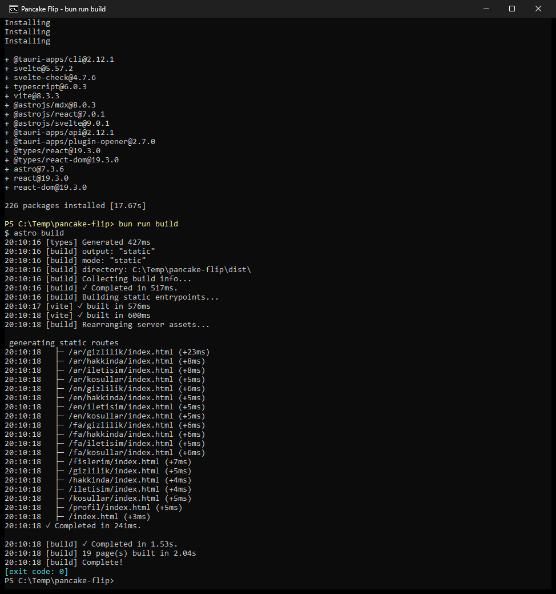
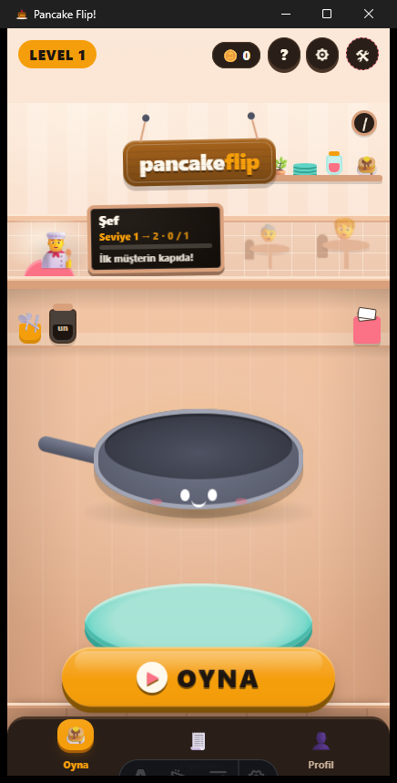

# Teslim — Batch 01 (Hafta 3)

Görev tanımı: [`tasks/week-3/09-progress-batch-01.task.md`](tasks/week-3/09-progress-batch-01.task.md) (hocanındır; bu belge onun depo tarafındaki kaydıdır). Eğitmenin ön değerlendirmesi: [`k1/01.review.md`](k1/01.review.md).

## 1. Batch 01 Tamamlama Kontrol Matrisi

Her madde depoda tek tek denetlendi (09.10.2026).

| No | Alan | Kanıt | Kontrol |
|:---:|---|---|:---:|
| 1 | **Fork & İşbirliği** | Depo `keyvanarasteh/hello-mobil`'in fork'u (GitHub: `fork=true`); collaborator'lar: `keyvanarasteh`, `RFKaya`, `RedRiveRR` | [x] |
| 2 | **Blackboard Teslimi** (kullanıcı adı + fork linki) | Eğitmen değerlendirmesi, Görev 01.1: "iki üye de formu süresinde doldurdu" ([`k1/01.review.md`](k1/01.review.md)) | [x] |
| 3 | **Proje Fikri** | [`proje-fikri.md`](proje-fikri.md) §2 "Temel Ekranlar ve İşlevler" | [x] |
| 4 | **Kurumsal README** | [`README.md`](../README.md): İstinye Üniversitesi logosu (`public/isu-logo.svg`), rozetler, öğrenci bilgileri | [x] |
| 5 | **Ajan Kural Dosyaları** | [`AGENTS.md`](../AGENTS.md), [`CLAUDE.md`](../CLAUDE.md), [`GEMINI.md`](../GEMINI.md); uyum testi: [`ajan-uyum-testi.md`](ajan-uyum-testi.md) | [x] |
| 6 | **Markalama** | [`branding.md`](branding.md) ve `src/styles/app.css` renk değişkenleri (gündüz + gece) | [x] |
| 7 | **Bilgi Sayfaları** | `src/pages/hakkinda.mdx`, `iletisim.astro`, `kosullar.mdx`, `gizlilik.mdx` (+ `en`, `ar`, `fa`) | [x] |
| 8 | **Mimari Ağaç** | [`mimari-agac.md`](mimari-agac.md): sayfa haritası (yalnızca gerçek rotalar), platform matrisi, ekran boyutları | [x] |
| 9 | **Derleme Doğrulaması** | `bun run build` → 19 sayfa, `Complete!`, 0 hata ([§2](#2-derleme-kanıtı-build-proof)) | [x] |

**Sonuç: 9 / 9**

## 2. Derleme Kanıtı (Build Proof)

Build kanıtı, güncel master'ın `C:\Temp\pancake-flip` altındaki temiz bir klonunda alınmıştır: gerçek bir PowerShell penceresinde `bun install` ve `bun run build` çalıştırıldı, pencerenin ekran görüntüsü alındı. Çıktıda 19 sayfanın tamamı, `19 page(s) built`, `Complete!` ve `exit code: 0` görünür.



## 3. Tauri Uygulaması (`bun run tauri dev`)

Tauri uygulaması aynı temiz klondan (`C:\Temp\pancake-flip`, güncel master) `bun run tauri dev` ile açıldı. Görüntü, çalışan uygulamanın kendi "Pancake Flip!" penceresinden alındı: lobi, tabela, şef ve karatahta, OYNA düğmesi ve alt menü. Alttaki küçük koyu araç çubuğu Astro'nun yalnızca geliştirme modunda görünen araç çubuğudur.



## 4. Doğrulama Özeti

| Komut | Sonuç |
|---|---|
| `bun test` | 91 geçti, 0 kaldı |
| `bun run build` | 19 sayfa, 0 hata |
| `cargo test` | 2 geçti, 0 kaldı |
| `bunx svelte-check` | 7 hata, 3 uyarı: hepsi önceden var olan taban ([`ajan-uyum-testi.md`](ajan-uyum-testi.md)) |

## 5. Sürüm Etiketi

Bu belge `master`'a birleştirildikten sonra `master` ucuna ilk kilometre taşı etiketi konur:

```bash
git checkout master
git pull origin master
git tag -a v0.1.0-batch-01 -m "Hafta 3: Batch 01 - Proje altyapısı, markalama ve sayfalar tamamlandı"
git push origin v0.1.0-batch-01
```

Doğrulama: `git ls-remote --tags origin v0.1.0-batch-01` ve GitHub'da **Tags** sekmesi.

## 6. Final ZIP ve Blackboard

Blackboard'a yükleme öğrencinin kendisi tarafından yapılır; bu depo yükleme yapmaz ve yüklemenin yapıldığını iddia etmez.

1. Etiket konduktan sonra GitHub'da depoyu açın: [`RFKaya/pancake-flip`](https://github.com/RFKaya/pancake-flip).
2. `master` dalında **Code → Download ZIP** ile projenin final halini indirin.
3. Blackboard'da Görev 09 teslim alanına bu tek `.zip` dosyasını yükleyin.
4. PR linki eklenmez: eğitmen (`keyvanarasteh`) collaborator olduğu için PR'ları ve diff'leri GitHub'da görür.
5. Son teslim: **09.10.2026 23:59**.
